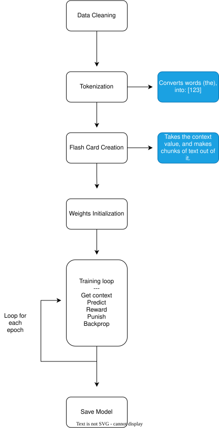

<div align="center">
     
    <h1 style="border:none;">PoemAI - An AI poem model from scratch</h1>
    <h3>A very small model trained to generate the semblance and style of poetry and Shakespearean text, without using libraries.</h3>
</div>

---

<h2 style="border:none;">About:</h2>

**PoemAI** is a small neural language model built from scratch with the goal of generating English poetry.

Instead of using something like PyTorch or fine-tuning an existing small LLM, I attempted to build a simple neural network to generate poetry, and it was trained on a large collection of English poetry.

This project is mainly a way for me to learn how LLMs and transformers work under the hood and attempt to build my own very basic one! It also helps me learn how processing the dataset and adjusting settings can affect the performance and overall quality of large language models, such as Top-K, epochs, learning rate, etc.

---

<h2 style="border:none;">Demo:</h2>

Try out a web version of it!
https://k754a.hackclub.app/PoemAi

This demo uses Flask and allows JavaScript to make a call to the server. In return, the output of the model is streamed back to the client.

---

<h2 style="border:none;">Running locally:</h2>

Clone the repository:

```text
git clone https://github.com/k754a/PoemAI.git
cd PoemAI
```

Then install the dependencies:

```text
pip install torch flask
```

Then you can run it:

```text
python Server/app.py
```

If you want to train the AI, you can open `.\PoemAI\C++AI\C++AI.slnx` in Visual Studio, then run it with `chat.py` in `\PoemAI\C++AI\C++AI`. You need NumPy installed, however.

---

<h2 style="border:none;">Dataset:</h2>

The model was trained mainly on a collection of English poetry, pulled from [gutenberg.org](https://www.gutenberg.org/), and contained approximately 1 million words.

<br>

The dataset was processed before training too:

* Remove punctuation
* Remove weird formatting and punctuation
* Remove Roman numerals, titles, and chapters
* Add new line `<NEWLINE>` characters for signalling new lines

<br>

Through this, it produced about 36,500 unique words.

---

<h2 style="border:none;">Training Steps:</h2>

<div align="center">
    
</div>

---

<h2 style="border:none;">Model:</h2>

PoemAI uses a very small, basic (dumb) neural network trained on a single CPU core.

The model settings:

| Parameter          | Value                           |
| ------------------ | ------------------------------- |
| **Training Data**  | ~1M Words of Shakespearean Text |
| **Hidden Neurons** | 512                             |
| **Context Size**   | 8                               |
| **Epochs**         | 400                             |
| **Learning Rate**  | 0.05                            |

The current model is about 0.7GB in size, using ~1GB of RAM.

The inference settings:

| Parameter          | Value   |
| ------------------ | ------- |
| **Max Tokens**     | 120     |
| **Top_K**          | 30      |
| **Repeat Penalty** | 0.75    |
| **Data Type**      | float32 |

Overall, a super small, basic model that can create good structure in poetry, but **vastly lacks coherence**.

---

<h2 style="border:none;">Model Performance</h2>

This model performs very well at recreating the structure and wording of the datasets, but struggles with creating coherent text overall.

Some examples of generated text are:

<code>the up right light poor th’ by thus better never bear can room heart me good he are man part as best may does dear husband being henry exit could old like thee call upon be name know done god there some eyes duke lady where speak away from yet they peace then
me—then highestthen notthen earthen beltthen ‘then upstaring—then me—when purpose—when faint—then see without ’tis passthen we once ‘“when will lords death great go long when now doth o so most in fool to on that act face nothing who take your
honour discolour farmyour faith—“neighbour “labour l’amour distance—your widowdolour too—your “four seymour unto—our ruin—your sir her courtodour off for i love you—your last forgot—your fire welcome</code>

<code>ask made death you blood house off welcome true ’tis lords and must nothing lord now go better word us in give thou many a all other madam by man there once how the too she god their thus not two may with lost gentleman for so here king very hear scene came it me peace night fear unto am eye when are be upon last fire one into or we take on will know queen being your both had heaven is yet could ford most think th’ see were come servant up great whose can any poor do name grace who where show richard duke part down my falstaff was but have without brother an exit thine old lady</code>

<code>thy so a here do too yet queen lord exit the take there that room who then gentle comes without true th’ house fear as if hath from of timon ’tis how see god such scene antony sir some came are whose good heaven son long my off man were myself last could every go keep madam eyes heart lady our to and thine call us was eye an fool act with time lords bear peace like they night where i great you name not will show before any king he must very being enough down both come give lost hear may aside upon think old when duke other after
he—master better noster presenter “better countercaster sophister bemonster chapter</code>

---

<h2 style="border:none;">Repository Structure:</h2>

```text
PoemAI/
├── .gitignore
├── C++AI/
│   ├── C++AI.slnx
│   └── C++AI/
│       ├── C++AI.cpp
│       ├── C++AI.vcxproj
│       ├── C++AI.vcxproj.filters
│       ├── ProcessData.cpp
│       ├── ProcessData.h
│       ├── Tokenizer.cpp
│       ├── Tokenizer.h
│       ├── chat.py
│       ├── poem_model.txt
│       └── poems.txt
├── README.md
├── Server/
│   ├── AI/
│   │   ├── .gitattributes
│   │   ├── __pycache__/
│   │   │   └── chat.cpython-311.pyc
│   │   ├── chat.py
│   │   ├── poem_model.txt
│   │   └── poem_weights.bin
│   ├── app.py
│   ├── develop/
│   │   ├── index.html
│   │   └── style.css
│   ├── static/
│   │   ├── image's/
│   │   │   ├── stardance-logo-df399a7f.avif
│   │   │   └── stardance-logo.png
│   │   └── style.css
│   └── templates/
│       └── index.html
├── __pycache__/
│   ├── ProcessData.cpython-311.pyc
│   ├── ProcessData.cpython-313.pyc
│   ├── Tokenizer.cpython-311.pyc
│   └── Tokenizer.cpython-313.pyc
├── cleanPoemDataset.py
├── old-python/
│   ├── PoemGen.py
│   ├── ProcessData.py
│   ├── Tokenizer.py
│   ├── Train.py
│   ├── poem_model copy.json
│   ├── poem_model.json
│   └── poetry.csv
└── poems.txt
```

---

# ⭐ Support the Project

If you find PoemAI interesting, please consider giving it a ⭐!

It helps more people discover the project!

---
